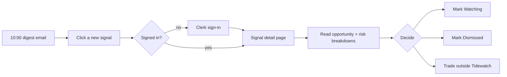
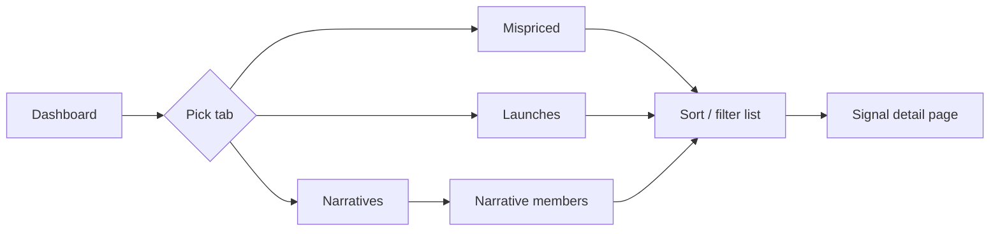
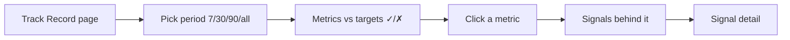
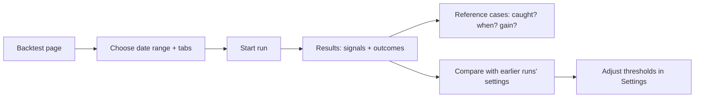

# Flow: Owner journeys

Source: PRD.md Section 2 (Flows A–D).

## A — Morning routine

```mermaid
flowchart LR
    A1[10:00 digest email] --> A2[Click a new signal]
    A2 --> A3{Signed in?}
    A3 -- no --> A4[Clerk sign-in] --> A5
    A3 -- yes --> A5[Signal detail page]
    A5 --> A6[Read opportunity + risk breakdowns]
    A6 --> A7{Decide}
    A7 --> A8[Mark Watching]
    A7 --> A9[Mark Dismissed]
    A7 --> A10[Trade outside Tidewatch]
```

## B — Browsing a tab

```mermaid
flowchart LR
    B1[Dashboard] --> B2{Pick tab}
    B2 --> B3[Mispriced]
    B2 --> B4[Narratives] --> B6[Narrative members]
    B2 --> B5[Launches]
    B3 & B5 & B6 --> B7[Sort / filter list]
    B7 --> B8[Signal detail page]
```

## C — Is it working?

```mermaid
flowchart LR
    C1[Track Record page] --> C2[Pick period 7/30/90/all]
    C2 --> C3[Metrics vs targets ✓/✗]
    C3 --> C4[Click a metric] --> C5[Signals behind it] --> C6[Signal detail]
```

## D — Backtest

```mermaid
flowchart LR
    D1[Backtest page] --> D2[Choose date range + tabs]
    D2 --> D3[Start run]
    D3 --> D4[Results: signals + outcomes]
    D4 --> D5[Reference cases: caught? when? gain?]
    D4 --> D6[Compare with earlier runs' settings]
    D6 --> D7[Adjust thresholds in Settings]
```
