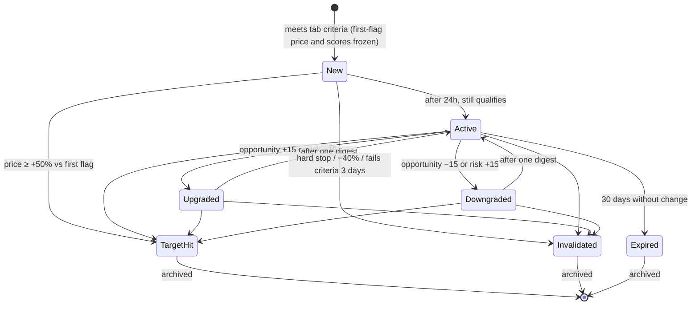

# Flow: signal lifecycle

Source: PRD.md 3.8; VISION.md D6.

```mermaid
stateDiagram-v2
    [*] --> New: meets tab criteria (first-flag price and scores frozen)
    New --> Active: after 24h, still qualifies
    Active --> Upgraded: opportunity +15 or risk −15
    Active --> Downgraded: opportunity −15 or risk +15
    Upgraded --> Active: after one digest
    Downgraded --> Active: after one digest
    New --> TargetHit: price ≥ +50% vs first flag
    Active --> TargetHit
    Upgraded --> TargetHit
    Downgraded --> TargetHit
    New --> Invalidated: hard stop / −40% / fails criteria 3 days
    Active --> Invalidated
    Upgraded --> Invalidated
    Downgraded --> Invalidated
    Active --> Expired: 30 days without change
    TargetHit --> [*]: archived
    Invalidated --> [*]: archived
    Expired --> [*]: archived
```

All thresholds are [CALIBRATE] defaults from PRD 3.8. A token re-flagged after archiving starts a new signal linked to the old one.
