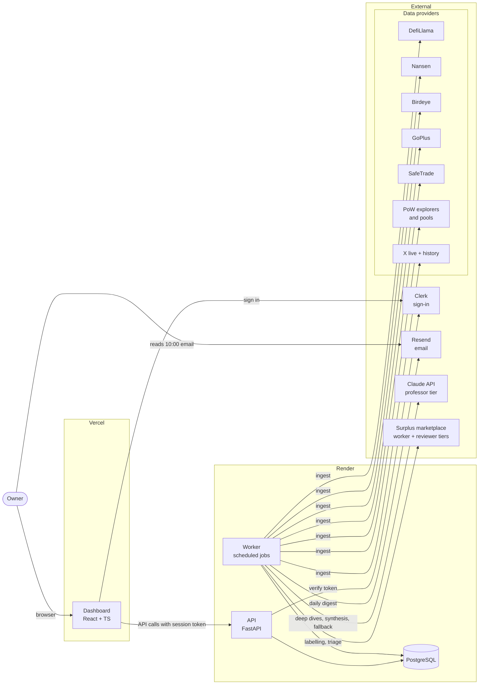
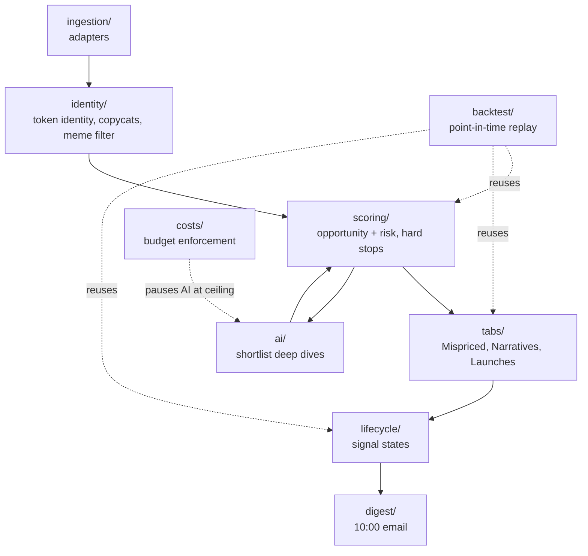

# System architecture

Source: ARCHITECTURE.md Sections 1, 2, 5, 6.

```mermaid
flowchart LR
    Owner([Owner])

    subgraph Vercel
        Web[Dashboard<br/>React + TS]
    end

    subgraph Render
        API[API<br/>FastAPI]
        Worker[Worker<br/>scheduled jobs]
        DB[(PostgreSQL)]
    end

    subgraph External
        Clerk[Clerk<br/>sign-in]
        Resend[Resend<br/>email]
        Claude[Claude API<br/>professor tier]
        Surplus[Surplus marketplace<br/>worker + reviewer tiers]
        subgraph DP[Data providers]
            DL[DefiLlama]
            NS[Nansen]
            BE[Birdeye]
            GP[GoPlus]
            ST[SafeTrade]
            PW[PoW explorers<br/>and pools]
            X[X live + history]
        end
    end

    Owner -->|browser| Web
    Owner -->|reads 10:00 email| Resend
    Web -->|sign in| Clerk
    Web -->|API calls with session token| API
    API -->|verify token| Clerk
    API --> DB
    Worker --> DB
    Worker -->|ingest| DL & NS & BE & GP & ST & PW & X
    Worker -->|labelling, triage| Surplus
    Worker -->|deep dives, synthesis, fallback| Claude
    Worker -->|daily digest| Resend
```

**Inside the worker** (one module per domain in `backend/tidewatch/`):

```mermaid
flowchart TD
    ING[ingestion/<br/>adapters] --> ID[identity/<br/>token identity, copycats, meme filter]
    ID --> SC[scoring/<br/>opportunity + risk, hard stops]
    SC --> TB[tabs/<br/>Mispriced, Narratives, Launches]
    TB --> LC[lifecycle/<br/>signal states]
    SC --> AI[ai/<br/>shortlist deep dives]
    AI --> SC
    LC --> DG[digest/<br/>10:00 email]
    COST[costs/<br/>budget enforcement] -.->|pauses AI at ceiling| AI
    BT[backtest/<br/>point-in-time replay] -.->|reuses| SC & TB & LC
```
